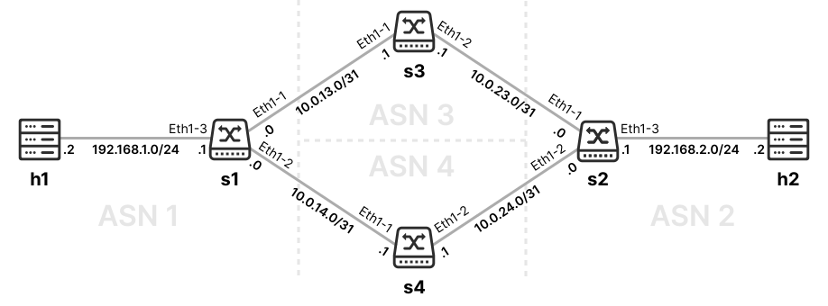

<h1 align="center">实验指导书（二）</h1>

[toc]


## 1. 实验背景


### 实验环境准备

实验一中已经配置了 Mininet 及 FRR 环境，本次实验在实验一的基础上进行。

1. 获取实验 Git 仓库
```bash
git clone https://github.com/XJTU-NetVerify/sdn-lab2.git
cd sdn-lab2
```

2. 运行样例，检验环境是否正常
```bash
sudo uv run example/main.py
# 需要等待一段时间（5秒左右），等待路由交换完成。
mininet> pingall
*** Ping: testing ping reachability
h1 -> h2 
h2 -> h1 
*** Results: 0% dropped (2/2 received)
```

## 2. 实验工具介绍

### 2.1 BGP

BGP（边界网关协议，Border Gateway Protocol）是全球互联网的核心路由协议，主要负责在不同的**自治系统**（Autonomous system, AS），即独立管理的大型网络，如各 ISP 的网络之间，交换路由和可达性信息。作为一种**路径向量**（Path Vector）协议，BGP 的核心作用不仅仅是寻找“最短”路径，而是基于网络策略、商业规则和安全性来进行复杂的路由决策，它通过维护一张庞大的全球路由表，确保数据包能够在错综复杂的全球互联网架构中无环路地准确传输。

尽管最初为连接全球广域网而设计，但近年来 BGP 也已成为现代大型数据中心内部网络的事实标准（de facto）路由协议。这主要得益于 BGP 经历了数十年互联网规模的考验，具备极高的稳定性和无可比拟的可扩展性；同时，它天然支持等价多路径（Equal-Cost Multi-Path Routing, ECMP）技术，能够完美契合数据中心内部海量东西向流量的高效负载均衡需求，加上其丰富的路由策略控制能力，使得网络管理员能够精准灵活地管理数据中心内部极其庞大的设备规模、复杂的流量调度以及故障隔离。

### 2.2 FRR
我们采用 FRR 路由套件在交换机上运行 BGP 协议。FRR（FRRouting）是一个衍生自 Quagga 的路由软件套件，它有一组守护进程共同构建路由表。每个主协议都在其自己的守护进程中实现，并且这些守护进程与独立于协议的核心守护进程 Zebra 通信，后者提供内核路由表更新、接口查找以及不同路由协议之间路由的重新分配。每个特定协议的守护进程负责运行相关协议并根据交换的信息构建路由表。

vtysh 是 FRR 路由引擎的集成 shell。它将每个守护进程中定义的所有 CLI 命令合并，并在单个 shell 中将它们呈现给用户。

vtysh 的命令模式与 CISCO IOS 类似。你可以通过 `show ip route`, `show ip bgp` 等命令查看路由表，或者使用命令进行配置。

### 2.3 frrnet

为方便大家在 mininet 中操作运行 FRR 的交换机[^1]，我们简单开发了一套基于 Mininet 的框架 frrnet。使用方式和 Mininet 基本相同：

```python
from frrnet import frrnet_main
from frrnet.topo import FrrTopo

class MyTopo(FrrTopo):
    def build(self):
        
        # Add hosts and switches
        leftHost = self.addHost('h1', ip="192.168.1.2/24", defaultRoute="via 192.168.1.1")
        leftSwitch = self.addSwitch('s1', daemons=["bgpd"])
        rightSwitch = self.addSwitch('s2', daemons=["bgpd"])
        rightHost = self.addHost('h2', ip="192.168.2.2/24", defaultRoute="via 192.168.2.1")

        # Add links
        self.addLink(leftSwitch, rightSwitch, intf1="Ethernet1-1", intf2="Ethernet1-1", bw=10, delay="10ms")
        self.addLink(leftHost, leftSwitch, intf2="Ethernet1-2")
        self.addLink(rightHost, rightSwitch, intf2="Ethernet1-2")

if __name__ == "__main__":
    frrnet_main(MyTopo)

```
运行时，使用 `sudo uv run path/to/main.py` 即可启动 Mininet CLI。此时，frrnet 会默认读取 `main.py` 上级目录下的 config 目录，将其中的配置文件作为交换机的配置；如 `config/s1.conf` 则对应交换机 s1 的配置。

[^1]: 此处“交换机”为三层交换机，几乎和路由器相同，在此实验中不负责二层交换，仅负责三层路由；但其实际作用是在数据中心内对主机的数据进行交换；为保证和数据中心的语义相同，我们这里使用“交换机”而非路由器。

但需注意一下几点：
1. 定义拓扑时，需继承 `frrnet.topo` 中的 FrrTopo 类而非 Mininet 的 Topo 类。
    ```diff
    - from mininet.topo import Topo
    + from frrnet.topo import FrrTopo
    
    - class MyTopo(Topo):
    + class MyTopo(FrrTopo):
    ```
2. 定义交换机时，需指定 daemons 参数，指定交换机运行的路由协议。
    ```python
    leftSwitch = self.addSwitch('s1', daemons=["bgpd"])
    rightSwitch = self.addSwitch('s2', daemons=["bgpd"])
    ```
3. 定义链路时，可以使用 `intf1`, `intf2` 定义两端的端口名称，使用 `bw` 定义链路带宽（单位 Mbps），使用 `delay` 定义链路时延。我们推荐为交换机端设置端口名称，方便编写配置文件。

    ```python
    self.addLink(leftSwitch, rightSwitch, intf1="Ethernet1-1", intf2="Ethernet1-1", bw=10, delay="10ms")
    ```
4. 定义拓扑后，需要调用 `frrnet_main` 函数，传入定义的拓扑类。
    ```python
    if __name__ == "__main__":
        frrnet_main(MyTopo)
    ```
5. 使用命令行对节点进行操作时，交换机默认使用 vtysh 解释**网络命令**（如 `show ip route`, `show ip bgp` 等）；若需要执行 **Shell 命令**（如 `ifconfig`, `ip addr` 等），则在命令前添加 `bash `。
    ```
    # 对于主机（Host），直接使用 shell 命令执行即可。
    
    mininet> h1 ifconfig
    h1-eth0: flags=4163<UP,BROADCAST,RUNNING,MULTICAST>  mtu 1500
        inet 192.168.1.2  netmask 255.255.255.0  broadcast 192.168.1.255
        inet6 fe80::200:ff:fe00:1  prefixlen 64  scopeid 0x20<link>
        ether 00:00:00:00:00:01  txqueuelen 1000  (Ethernet)
    ```
    ```
    # 对于交换机（Switch），直接执行默认使用 vtysh 解释网络命令。
    
    mininet> s1 show ip bgp
    BGP table version is 2, local router ID is 192.168.1.1, vrf id 0
    Default local pref 100, local AS 1
    Status codes:  s suppressed, d damped, h history, u unsorted, * valid, > best, = multipath,
                i internal, r RIB-failure, S Stale, R Removed
    Nexthop codes: @NNN nexthop's vrf id, < announce-nh-self
    Origin codes:  i - IGP, e - EGP, ? - incomplete
    RPKI validation codes: V valid, I invalid, N Not found
    
        Network          Next Hop            Metric LocPrf Weight Path
    *>  192.168.1.0/24   0.0.0.0(fedora43)
                                                0         32768 i
    *>  192.168.2.0/24   10.0.0.1(fedora43)
                                                0             0 2 i
    ```
    ```
    # 若需在交换机中执行 Shell 命令，需在命令前添加 `bash `。
    
    mininet> s1 bash ifconfig
    Ethernet1-1: flags=4163<UP,BROADCAST,RUNNING,MULTICAST>  mtu 1500
            inet 10.0.0.0  netmask 255.255.255.254  broadcast 255.255.255.255
            inet6 fe80::9c2d:9dff:feec:9233  prefixlen 64  scopeid 0x20<link>
    
    # 但我们也为ping、traceroute等命令开了后门。
    mininet> s1 ping h1 -c1
    PING 192.168.1.2 (192.168.1.2) 56(84) bytes of data.
    64 bytes from 192.168.1.2: icmp_seq=1 ttl=64 time=0.045 ms
    
    --- 192.168.1.2 ping statistics ---
    1 packets transmitted, 1 received, 0% packet loss, time 0ms
    rtt min/avg/max/mdev = 0.045/0.045/0.045/0.000 ms
    
    ```
    `frrnet` 的实现非常简单，感兴趣的同学可以阅读或者修改[源代码](https://github.com/endaytrer/frrnet)，了解如何定义自定义的交换机类，或者创建使用其他路由套件的交换机。

## 3. Warm-up

在实验的热身环节，我们将带你学习BGP路由协议的原理及相关配置方法。我们主要探索BGP路由协议在数据中心中的简单应用：我们将主要使用 eBGP（External BGP）来配置路由，并使用路由策略（Route Policy）来控制路由选择。我们不会涉及到复杂的 iBGP（Internal BGP）、路由反射器（Route Reflectors）等配置，感兴趣的同学也可以使用更高级的配置方法完成实验。

### 3.1 路由交换

我们为实验准备的样例中，已经配置了一个基本的 BGP 路由交换配置：两台主机（h1 和 h2）分别连接交换机 s1 和 s2，s1 和 s2 之间有一条 10Mbps，延迟 10ms 的链路。


h1（h2）只配置了默认路由，将流量转发到 s1（s2）。但在 h1（h2）往 h2（h1）方向的数据包到达 s1（s2）之后，s1（s2）由于没有配置通往 h2（h1）的路由表项，所以无法将数据包转发给下一跳 s2（s1）。为了确保 h1 和 h2 联通，需要在 s1 和 s2 之间交换路由信息。

我们逐行阅读 s1 的配置文件，了解其工作原理：
```
frr defaults datacenter
!
!
interface Ethernet1-1
  ip address 10.0.0.0/31
!
interface Ethernet1-2
  ip address 192.168.1.1/24
!
!
router bgp 1
  neighbor 10.0.0.1 remote-as 2
  network 192.168.1.0/24

```
其中：
- 第 1 行 (`frr defaults datacenter`)：定义交换机的默认配置剖面（Profile），`datacenter` 反映出一个具有域内链接的单一管理域，并使用了更加激进的计时器策略，加速 BGP 邻居建立和路由交换。
- 第 2-3 行 (`!`)：空行，用于分隔不同的配置。
- 第 4-5 行 (`interface Ethernet1-1`)：定义交换机的端口配置，`Ethernet1-1` 是交换机的接口名称，`ip address` 定义接口的 IP 地址和子网掩码。
- 第 11 行 (`router bgp 1`)：定义这个交换机需要启用BGP进行路由交换。`1` 是 BGP 自治系统编号，即 ASN（Autonomous System Number）。

为达到路由交换的目的，一台交换机上的 BGP 进程需要知道以下信息：
- 我需要和**谁**进行路由交换。
    为此，我们定义 BGP **邻居**（neighbor），即路由交换的对象。配置中第 12 行定义了这样的一个邻居:
    ```
    neighbor 10.0.0.1 remote-as 2
    ```
    其中，`10.0.0.1` 代表邻居的IP地址，`remote-as 2` 代表邻居的自治系统编号（ASN）为 2。

    需要注意的是，为了要和邻居交换信息，需要确保邻居的 IP 地址是可达的。由于 s2 的 ip 已经在 Ethernet1-1 接口的子网内，所以 s2 是可达的，s1 可以与 s2 进行路由交换。除了通过这种使用二层链路的方式保证可达之外，我们还可以通过域内路由协议（Interior Gateway Protocol, IGP，如RIP、OSPF、IS-IS 等路由协议）来保证邻居可达[^2]。

    邻居的自治系统编号（ASN）决定了和邻居的连接是 eBGP 连接还是 iBGP 连接。若邻居的 ASN 与本机不同，则为 eBGP 连接；若邻居的 ASN 与本机相同，则为 iBGP 连接。在本实验中，我们只需要使用 eBGP 连接，所以需要确保邻居的 ASN 不同。
    
- 我需要和邻居交换**哪些路由**。
   为此，我们定义 BGP **网络**（network），即要交换的路由。配置中第 13 行定义了这样的一个网络:
   ```
   network 192.168.1.0/24
   ```
   其中，`192.168.1.0/24` 代表要交换的路由网络。

   需要注意的是，为保证路由成功被交换，我们需要保证该网段已经通过链路或者IGP的方式存在于路由表（Main RIB, routing information base）中。由于`192.168.1.0/24` 是接口 `Ethernet1-2` 的子网，已经通过直连链路的方式存在于 s1 的路由表中，所以 s1 的 `192.168.1.0/24` 可以被宣告（Advertise）给 s2。

   我们只需要定义该交换机”拥有“的网络即可，若一个 eBGP 邻居给某一交换机宣告了一条路由，那么该交换机会自动给其他所有 eBGP 邻居宣告接收到的路由。

[^2]: 由于 BGP 的内部机制，若使用 IGP 进行 eBGP 邻居的建立，可能需要配置 eBGP multihop 属性确保邻居建立成功。参考[https://docs.frrouting.org/en/latest/bgp.html#clicmd-neighbor-PEER-ebgp-multihop](https://docs.frrouting.org/en/latest/bgp.html#clicmd-neighbor-PEER-ebgp-multihop)

运行 `example/main.py` 后，我们可以看到路由交换成功。使用 `show ip bgp` 网络命令查看交换到的 BGP 路由信息。

```
mininet> s1 show ip bgp
Default local pref 100, local AS 1
Status codes:  s suppressed, d damped, h history, u unsorted, * valid, > best, = multipath,
               i internal, r RIB-failure, S Stale, R Removed
Nexthop codes: @NNN nexthop's vrf id, < announce-nh-self
Origin codes:  i - IGP, e - EGP, ? - incomplete
RPKI validation codes: V valid, I invalid, N Not found

     Network          Next Hop            Metric LocPrf Weight Path
 *>  192.168.1.0/24   0.0.0.0(fedora43)
                                             0         32768 i
 *>  192.168.2.0/24   10.0.0.1(fedora43)
                                             0             0 2 i

Displayed 2 routes and 2 total paths
```
关注下方 Network 表格，我们可以看到 s1 现在有两条 BGP 路由：192.168.1.0/24 和 192.168.2.0/24。其中，192.168.1.0/24 为其本身宣告的网络，192.168.2.0/24 为其从 s2 接收的网络，两条路由均为合法（valid, 用 `*` 标记）的、最佳（用 `>` 标记）的路由。

我们观察 s1 从 s2 处得到的路由 192.168.2.0/24。和 RIP 类似，BGP 会采用路由的源头（即此处 s2）作为新增路由表项的下一跳；因此，当 s1 收到目的 ip 为 192.168.2.0/24 的数据包时，会将数据包转发给 s2。

#### 热身任务
运行 `example/main.py`，（可选）观察路由交换的数据包，了解 BGP 路由交换的机制。

### 3.2 BGP 路由选路、ECMP 和路由策略

我们定义一个稍微复杂一些的网络。其中，s1 和 s2 仍然连接主机 h1 和 h2，s1 和 s2 此时通过中间节点 s3 和 s4 形成两条路径。



#### 3.2.1 路由选路

如同热身 3.1，我们通过配置 s3 和 s4 的 BGP 进程，实现 s1 -> s3 -> s2 的路由交换。值得注意的是，s3 和 s4 作为中间的 AS，并不需要宣告路由，所以这两台交换机并不需要配置 networks，仅需配置 neighbors。

运行 `warmup/main.py` 时，可以看到 h1 和 h2 之间可达。我们使用 `traceroute`（实验虚拟机需使用 `pacman -S traceroute` 下载 `traceroute`）检验 h1 和 h2 的路径。

```
mininet> h1 traceroute h2
traceroute to 192.168.2.2 (192.168.2.2), 30 hops max, 60 byte packets
 1  _gateway (192.168.1.1)  0.035 ms  0.003 ms  0.002 ms
 2  10.0.13.1 (10.0.13.1)  23.831 ms  23.819 ms  23.812 ms
 3  10.0.23.0 (10.0.23.0)  46.932 ms  46.928 ms  46.924 ms
 4  192.168.2.2 (192.168.2.2)  46.919 ms  46.881 ms  46.874 ms
```
我们会发现，h1 总是通过 s3（10.0.13.1）到达 h2，始终不会经过 s4。我们再观察 s1 的 BGP 信息：

```
mininet> s1 show ip bgp
BGP table version is 2, local router ID is 192.168.1.1, vrf id 0
Default local pref 100, local AS 1
Status codes:  s suppressed, d damped, h history, u unsorted, * valid, > best, = multipath,
               i internal, r RIB-failure, S Stale, R Removed
Nexthop codes: @NNN nexthop's vrf id, < announce-nh-self
Origin codes:  i - IGP, e - EGP, ? - incomplete
RPKI validation codes: V valid, I invalid, N Not found

     Network          Next Hop            Metric LocPrf Weight Path
 *>  192.168.1.0/24   0.0.0.0(fedora43)
                                             0         32768 i
 *>  192.168.2.0/24   10.0.13.1(fedora43)
                                                           0 3 2 i
 *                    10.0.14.1(fedora43)
                                                           0 4 2 i

Displayed 2 routes and 3 total paths
```
可以发现，经 s4 的路径存在，但并不被标记为最优的。这是为什么呢？

我们知道，BGP 是一个“路径向量”（Path Vector）协议；与 RIP 等“距离向量”协议不同，BGP 会记录到达目的地的全部路径（而不仅仅路径长度 weight 或者 metric ），并根据一套规则选定最优路由。在上面的 `show ip bgp` 当中，我们可以看到 Path 一列展示了本 AS 到目的地经过的所有的 AS 号，这条路径被称为 **AS-Path**：

```
    Network         Next Hop   .......  Path
 *> 192.168.1.0/24  0.0.0.0    .......  i
 *> 192.168.2.0/24  10.0.13.1  .......  3 2 i
 *                  10.0.14.1  .......  4 2 i
```
例如，`3 2 i` 代表首先需要通过 ASN 3（s3）、然后到 ASN 2 (s2)，最后到达路由的起源，用 i 表示。其长度即为经过 AS 的个数，此处为 2 个。

BGP 会根据 AS-Path 等因素，决定最优路由。具体决定顺序（Tie-breaker）如下[^3]：

1. Local Weight，每台交换机自行设置的权重（Cisco 私有属性，但 FRR 等主流路由软件也已支持）
2. **Local Preference**，AS 内部对于这个路由的的优先级，默认为 100，越高越优先。
3. AIGP(Accumulated Interior Gateway Protocol)，默认关闭
4. **AS-Path Length**，长度越短越优先
5. Origin，IGP 优先于 EGP（弃用），EGP 优先于 Incomplete
6. MED（Multi-Exit Discriminator）
7. eBGP over iBGP Paths
8. IGP Metric to BGP next hop，即比较下一跳的 IGP Metric
9. Path that was received first，即先收到的路由优先
10. **Neighbor Router ID**，较小的优先
11. Cluster list length
12. Neighbor IP Address

[^3]: https://en.wikipedia.org/wiki/Border_Gateway_Protocol#Route_selection_process

BGP会从上至下依次检验两条路由的属性，若分出优劣则选用较优路由，否则比较下一项属性。我们关注其中加粗的 2、4、10 三项：

- **Local Preference**：由于这几台交换机均为设定，所以两条路由在此处没有分别。
- **AS-Path Length**：两个路由的 AS-Path 长度相同，两者没有分别。
- **Neigbor Router ID**：Router ID 为 BGP 标识路由器的编号，一般为 Lookback 接口 IP 地址，或者所有 IP 地址中的较大者。此时，s3 的 router ID 为 10.0.23.1，而 s4 的 router ID 为 10.0.24.1，故选择 s3 作为较优路由。

#### 3.2.2 ECMP

此时，BGP 只能利用两条链路中的一条；使用 `iperf` 测量 h1 和 h2 的吞吐量（throughput）。此处我们使用 `-P 4` 指定 4 个线程，以利用所有链路带宽：
```
mininet> h1 iperf -s &
mininet> h2 iperf -c h1 -P 4
------------------------------------------------------------
Client connecting to 192.168.1.2, TCP port 5001
TCP window size: 16.0 KByte (default)
------------------------------------------------------------
[  4] local 192.168.2.2 port 34450 connected with 192.168.1.2 port 5001
[  3] local 192.168.2.2 port 34432 connected with 192.168.1.2 port 5001
[  2] local 192.168.2.2 port 34430 connected with 192.168.1.2 port 5001
[  1] local 192.168.2.2 port 34462 connected with 192.168.1.2 port 5001
[ ID] Interval       Transfer     Bandwidth
[  1] 0.00-16.60 sec  5.03 MBytes  2.54 Mbits/sec
[  2] 0.00-16.62 sec  4.99 MBytes  2.52 Mbits/sec
[  3] 0.00-17.04 sec  4.29 MBytes  2.11 Mbits/sec
[  4] 0.00-17.06 sec  5.09 MBytes  2.50 Mbits/sec
[SUM] 0.00-17.06 sec  19.4 MBytes  9.54 Mbits/sec
```

此时，我们可以在 s1 和 s2 的 bgp 配置中，加入以下配置（注意更改配置后需要重新启动 Mininet）：
```diff
# s1.conf
  router bgp 1
+   bgp bestpath as-path multipath-relax
    neighbor 10.0.13.1 remote-as 3
    neighbor 10.0.14.1 remote-as 4
    network 192.168.1.0/24

```
我们再查看 s1 的 BGP 信息：
```
mininet> s1 show ip bgp
......
 *>  192.168.2.0/24   10.0.13.1(fedora43)   3 2 i
 *=                   10.0.14.1(fedora43)   4 2 i
```
可见。此时下一跳 10.0.14.1 被标上了 “=”，代表启用了 BGP 多路径。这种多路径被称之为 Equal-Cost Multi-Path（等价多路径，ECMP）。

此时，再次使用 `iperf` 测试吞吐量：

```
mininet> h1 iperf -s &
mininet> h2 iperf -c h1 -P 4
------------------------------------------------------------
Client connecting to 192.168.1.2, TCP port 5001
TCP window size: 16.0 KByte (default)
------------------------------------------------------------
[  1] local 192.168.2.2 port 33696 connected with 192.168.1.2 port 5001
[  3] local 192.168.2.2 port 33714 connected with 192.168.1.2 port 5001
[  2] local 192.168.2.2 port 33706 connected with 192.168.1.2 port 5001
[  4] local 192.168.2.2 port 33720 connected with 192.168.1.2 port 5001
[ ID] Interval       Transfer     Bandwidth
[  1] 0.00-13.87 sec  6.79 MBytes  4.11 Mbits/sec
[  3] 0.00-14.17 sec  9.25 MBytes  5.48 Mbits/sec
[  2] 0.00-14.30 sec  9.32 MBytes  5.47 Mbits/sec
[  4] 0.00-14.30 sec  6.88 MBytes  4.03 Mbits/sec
[SUM] 0.00-14.30 sec  32.2 MBytes  18.9 Mbits/sec
```

可以看到，两者之间的吞吐量提高了一倍。

#### 3.2.3 路由策略

那此时，我们如果想要流量仅通过 s4 而不通过 s3 需要怎么办？

一个直观的方法是，利用路由选路的优先级，让 s1 和 s2 更加倾向于选择从 s4 来的路由。但是我们通常难以控制路由传播路径中的 AS-Path 长度，所以，我们通常需要配置交换机，使其可以改变一条路由的属性（如 Local preference，AS-Path 长度，或者直接拒收从某出来的路由、拒绝将路由发给某些节点）。

因此，BGP 协议设置了丰富的**路由策略**（Route Policy，RP，也叫路由映射（Route Map））。路由策略好比一个 if-then-else 语句，通过**匹配项**（match）匹配某些具体的路由，通过**设置项**（set）设置路由的属性，通过 **permit/deny** 来控制路由是否需要被拒收、拒发。

例如，我们想对 s1 从 s3 接受的路由设置更低的 Local preference，我们可以这样做：
```diff
+ route-map LOWER_LP permit 10
+   set local-preference 50
  !
  !
  router bgp 1
    bgp bestpath as-path multipath-relax
    neighbor 10.0.13.1 remote-as 3
+   neighbor 10.0.13.1 route-map LOWER_LP in
```
在第 8 行，我们对于邻居 10.0.13.1 新增加了一个路由策略，其匹配从该邻居处收到（`in`，如果为 `out` 则匹配发往该邻居的路由）的路由，应用名为 `LOWER_LP` 的路由策略。

在第 1 行，我们定义了 `LOWER_LP` 的路由策略，`permit` 意为其默认允许接受这条路由，10 代表这一步的优先级（如果我们想在 `set local-preference` 之前进行其他操作，我们可以定义 `route-map LOWER_LP permit 5`，并附上需要的操作；在之后，则可以使用 `permit 20` 等）。在此之后，我们可以定义一系列操作，例如此处，我们设置（`set`）了 local preference 为 50。

此时，我们再查看 s1 的 BGP 属性：
```
     Network          Next Hop            ... LocPrf ... Path
 *>  192.168.2.0/24   10.0.14.1(fedora43) ...        ... 4 2 i
 *                    10.0.13.1(fedora43) ...   50   ... 3 2 i
```
发现，从 s3 方向过来的路由已经标上了更低的 local preference，因此 multipath 标记（“=”）已经消失，s1 将只会选择更高 local preference 的 s4 作为 192.168.2.0/24 的下一跳。

除了设置 local preference 之外，我们还可以操纵路由的 AS-Path 信息，使其变得更短、更长或者更改其中的某一些部分。例如，`set as-path prepend 5 5 5 5 5` 会在已有的 AS Path 之前加入 5 个 5，让其变得更长；`set as-path replace any` 会将 AS Path 上的所有 AS 号变为自己的 AS 号；`set as-path exclude all` 会直接清空 AS Path 中的所有 AS 号。

此外，你还可以进行匹配某一些 IP 地址（搜索关键词 `ip prefix-list`），在上游设置 BGP Community、在下游设备匹配 BGP Community（可以理解为在路由中设置一些标志位，以供收到路由的设备进行筛选）等高级的操作。

以下是一个示例的路由策略配置，其允许 10.0.0.0/8 网段内的，前缀长度 $\geq8$ 且 $\leq 24$ 的子网的路由，并将其设置 BGP community 65535:1234；如果不满足这样的前缀条件，策略还可以允许设置了 BGP community 65535:1111 的路由；其他路由则均会拒收/拒发。

```
! 定义prefix-list，用于匹配路由的网段。
!
! 若不设置ge和le，默认精确匹配前缀10.0.0.0/8。此时，10.0.0.0/16等网段均不会被匹配到。
! 否则，则会匹配网段下符合前缀长度大于等于ge、小于等于le的所有子网。
!
ip prefix-list MY_PREFIX_LIST seq 10 permit 10.0.0.0/8 ge 8 le 24
!
!
! 定义community-list，负责匹配一系列BGP Community的值。
!
bgp community-list standard MY_COMMUNITY_LIST permit 65535:1111
!
!
! 定义路由策略。
!
route-map MY_ROUTE_MAP permit 10
  match ip address prefix-list MY_PREFIX_LIST
  set community 65535:1234
!
route-map MY_ROUTE_MAP permit 20
  match community MY_COMMUNITY_LIST
!
route-map MY_ROUTE_MAP deny 30 ; 其他不符合条件的一律拒收/拒发。若不加这一行，其他未匹配到的也会默认拒收。
```

若想要完成附加题，我们鼓励大家阅读更多关于路由策略的内容：[FRR 文档](https://docs.frrouting.org/en/latest/routemap.html)

#### 3.2.4 热身任务
1. 运行 `warmup/main.py`。
2. 启用 ECMP，观察主机间吞吐量变化。
3. 在第 2 步的基础上，为交换机配置路由策略，使得流量只经过 s4 而不经过 s3。
4. （可选）了解路由策略的执行机理，尝试路由策略其他不同的匹配选项和设置选项。

## 4. 实验内容

### 必做题：数据中心网络设计

Lab 1 中，你采用了生成树协议，建立了以 Fat-tree 为拓扑的数据中心网络。老板新采购了一批三层交换机，替换这些使用生成树协议的二层交换机，需要你完成配置。你需要充分利用 Fat-tree 的冗余链路，提升数据中心主机间吞吐量和容错能力。

1. 参照 Lab 1 中的 Fat-tree 拓扑定义脚本，定义采用 FRR 交换机的，$k=4$ 的 Fat-tree 拓扑。要求：主机到边缘（edge）交换机的链路不设置带宽/时延；交换机之间的链路需设置 10Mbps 的带宽和 10ms 的时延。
2. 学习热身 1、2 中的配置模版，自行设计网段分配方案，每个交换机独立分配一个 AS 号，并据此对交换机进行配置，建立采用 BGP 协议的数据中心网络。
3. 确保主机间可以联通。若主机未连通，分析问题并解决，可以通过 `show ip bgp`, `show ip route`, `show ip bgp neighbors` 等命令分析，或者使用 Wireshark 抓包分析。
4. 修改配置，开启 ECMP，使用 `iperf` 观察主机间吞吐量变化。

### 选做题：ASN 复用

通常来说，BGP 协议规定的大部分（16位）AS 号码是全球唯一的，仅有 64512-65534 这 1023 个号码可供私有使用。同时，为了确保网络管理的高效，数据中心通常会在同一层的设备上复用同一个 AS 号码。

选做题中，你需要让核心层的所有设备共用 ASN 65001，剩下的设备中，每个 Pod 汇聚层的设备共用一个 AS 号码，每个 Pod 边缘层的设备共用一个 AS 号码。这听起来很简单，但实际过程中，你可能会遇到一些问题；请你分析并找到问题的原因，并且采用路由策略或者其他方式解决这个问题，确保联通性，并保证仍然具有相同的 Multipath 条数。

附加题占分值较小，主要面向学有余力的同学，请结合自身实际决定是否选做。

最后，完成实验报告并提交到思源学堂；要求不能使用控制器和其他协议。


## 5. 一些有用的资料

1. FRR 相关文档，在这里可以找到关于配置的几乎所有信息：https://docs.frrouting.org/en/latest/
2. NetworkLessons（付费资源）：https://networklessons.com/bgp
3. Cisco 的文档和 Blog：https://www.cisco.com/c/en/us/td/docs/ios-xml/ios/iproute_bgp/configuration/xe-16/irg-xe-16-book/configuring-a-basic-bgp-network.html
4. 华为的相关文档：https://info.support.huawei.com/info-finder/encyclopedia/zh/BGP.html
5. BGP Wikipedia：https://en.wikipedia.org/wiki/Border_Gateway_Protocol
