<h1 align="center">实验指导书（三）</h1>


[toc]

## 零、下载实验工程

1. **获取实验Git仓库**

    ```bash
    git clone https://github.com/XJTU-NetVerify/sdn-lab3.git
    cd sdn-lab3
    ```

2. **安装依赖和初始化**

    ```bash
    uv sync
    ```

3. **运行OS-Ken App**

    ```bash
    uv run -m controllers.simple_switch
    ```

## 一、OVS查看交换机流表

- 查看交换机`s1`的流表

```shell
sudo ovs-ofctl dump-flows s1
```

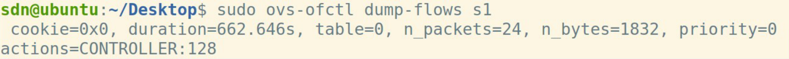


- 只查看`OpenFlow1.3`的流表项

```shell
sudo ovs-ofctl -O OpenFlow13 dump-flows s1
```

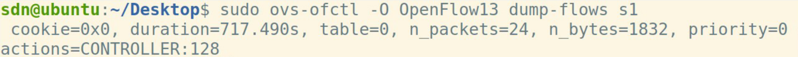

## 二、Wireshark对控制器抓包

启动`WireShark`，监听`Loopback:lo`端口。

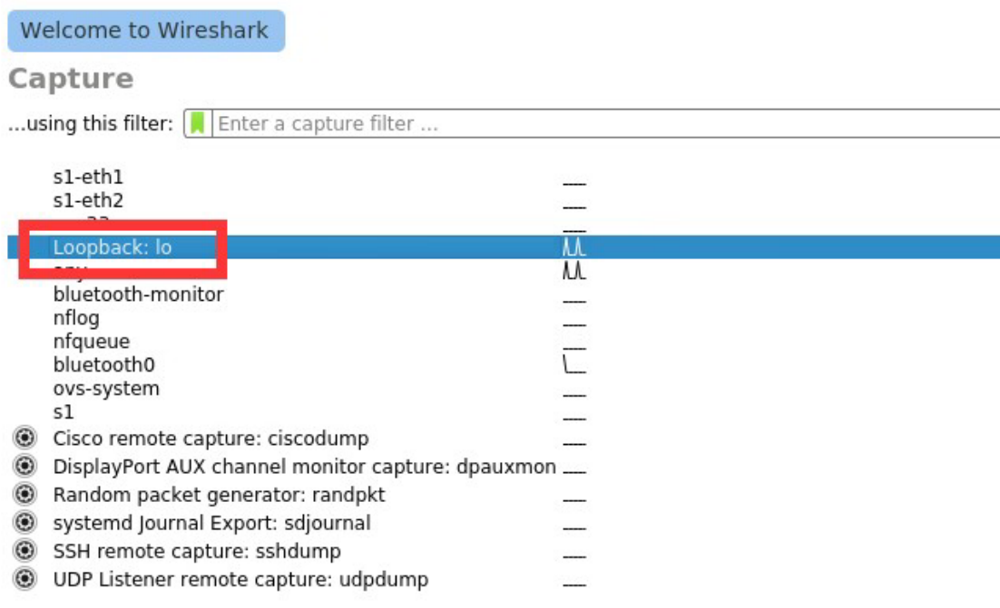

## 三、如何运行OS-Ken APP

Ryu现已不再维护；因此，我们在实验中选用从Ryu fork的，目前正在积极维护中的**OS-Ken**。其大部分内容和Ryu通用。

以运行`OS-Ken`提供的查看拓扑的`APP`为例：

- `mininet`创建拓扑。

```shell
sudo mn --custom topos/topo_2sw_2host.py --topo mytopo --controller remote
#remote表示不用`Mininet`自带的控制器，尝试使用`OS-Ken`等远端控制器。
```

- 运行OS-Ken App；注意需要使用`-m`运行Python模块，而非直接运行Python文件。

```shell
uv run -m controllers.simple_switch
```

## 四、OS-Ken编程示例：简单交换机

### 2. 运行

- `mininet`创建树状拓扑

    ```
    sudo mn --controller remote --mac --topo=tree,2,2
    ```

- 启动控制器

    ```
    uv run -m controllers.simple_switch
    ```

- 在`mininet`的`CLI`中启动`wireshark`抓取端口`h4-eth0`

    ```
    mininet> h4 wireshark &
    ```

- 在`mininet`中`h1 ping h3`，查看`wireshark`中关于`h4`的抓包情况

    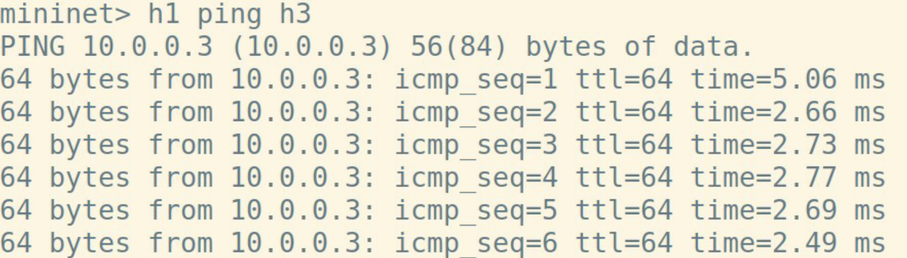

    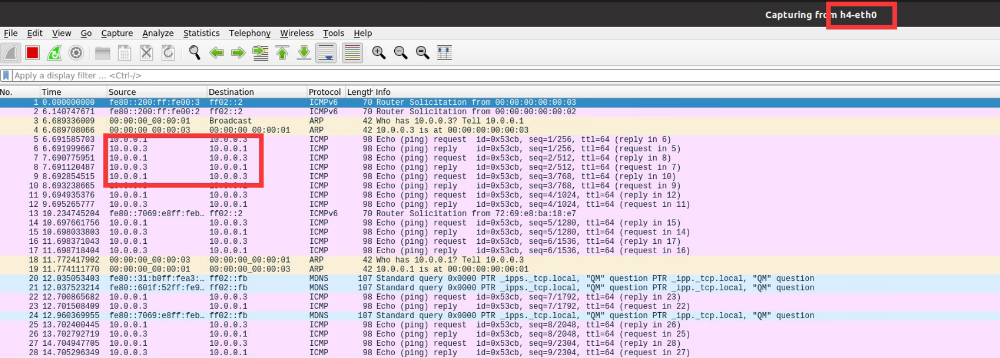

    抓包结果显示该交换机存在验证缺陷：`packet_in_handler`函数会将数据包洪泛到交换机的所有端口，故`h1`和`h3`通讯时，`h4`也会收到所有的包。

## 五、实验任务

### 1. 实验任务一：自学习交换机

你在数据中心的网络配置中表现的非常出色，于是老板安排你完成新的任务：去构建一个横跨美国的教育和科研网络，取名为ARPANET。

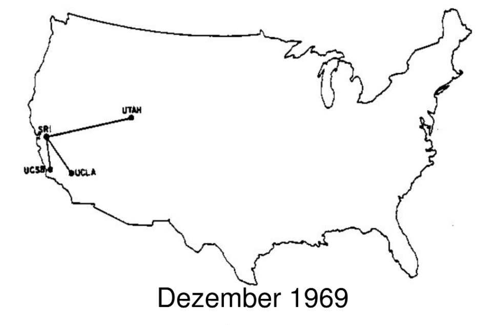

1969年的`ARPANET`非常简单，仅由四个节点组成。假设每个节点都对应一个交换机，每个交换机都具有一个直连主机，你的任务是实现不同主机之间的正常通信。

前文给出的简单交换机洪泛数据包，虽然能初步实现主机间的通信，但会带来不必要的带宽消耗，并且会使通信内容泄露给第三者。因此，请你**在简单交换机的基础上实现二层自学习交换机，避免数据包的洪泛**。

### 问题说明

- `SDN`自学习交换机的工作流程可以参考：
  	1. 控制器为每个交换机维护一个`mac-port`映射表。
  	2. 控制器收到`packet_in`消息后，解析其中携带的数据包。
  	3. 控制器学习`src_mac - in_port`映射。
  	4. 控制器查询`dst_mac`，如果未学习，则洪泛数据包；如果已学习，则向指定端口转发数据包(`packet_out`)，并向交换机下发流表项(`flow_mod`)，指导交换机转发同类型的数据包。

- 网络拓扑为[`topos/topo_1969_1.py`](topos/topo_1969_1.py)，启动方式：

  ```shell
  sudo uv run topos/topo_1969_1.py
  ```

- 可以不考虑交换机对数据包的缓存(`no_buffer`)。

### 代码框架

[`controllers/task1/self_learning_switch.py`](controllers/task1/self_learning_switch.py)给出了代码框架，只需补充关键的若干行实现即可。

### 结果示例

`UCLA ping UTAH`，`UCSB`不再收到相关数据包：

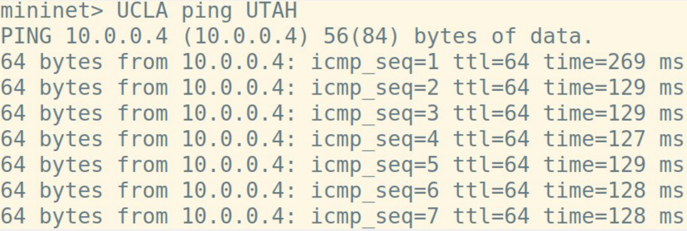

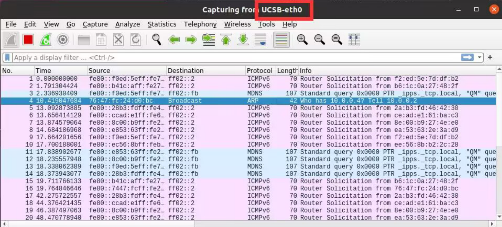

### 2. 实验任务二：处理环路广播

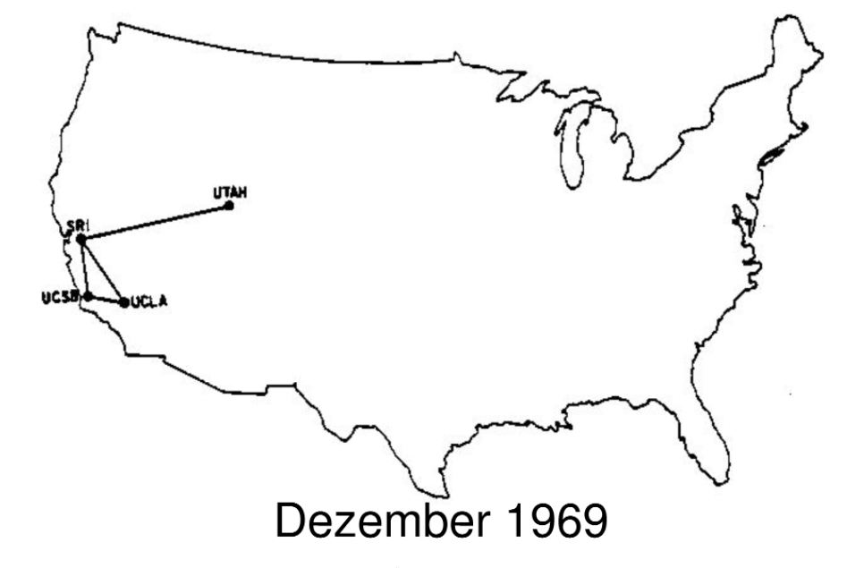


`UCLA`和`UCSB`通信频繁，两者间建立了一条直连链路。在新的拓扑`topo_1969_2.py`中运行自学习交换机，`UCLA`和`UTAH`之间无法正常通信。分析流表发现，源主机虽然只发了很少的几个数据包，但流表项却匹配了上千次；`WireShark`也截取到了数目异常大的相同报文。

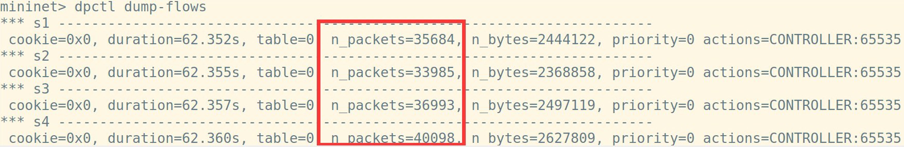

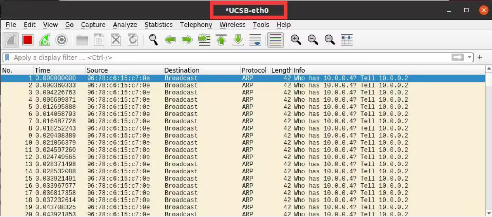

这实际上是`ARP`广播数据包在环状拓扑中洪泛导致的，传统网络利用**生成树协议**解决这一问题。在`SDN`中，不必局限于生成树协议，可以通过多种新的策略解决这一问题。以下给出一种解决思路，请在自学习交换机的基础上完善代码，解决问题：

当序号为`dpid`的交换机从`in_port`第一次收到某个`src_mac`主机发出，询问`dst_ip`的广播`ARP Request`数据包时，控制器记录一个映射`(dpid, src_mac, dst_ip)->in_port`。下一次该交换机收到同一`(src_mac, dst_ip)`但`in_port`不同的`ARP Request`数据包时直接丢弃，否则洪泛。

#### 代码框架

见[`controllers/task2/loop_detecting_switch.py`](controllers/task2/loop_detecting_switch.py)

#### 结果示例

解决`ARP`数据包在环状拓扑中的洪泛问题后，`UCLA`和`UTAH`之间可以`ping`通，并且流表项的匹配次数明显减少：

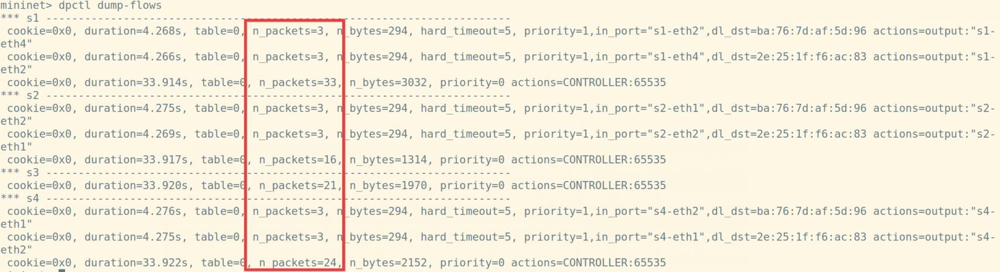

### 3. 实验任务三：优化路由策略

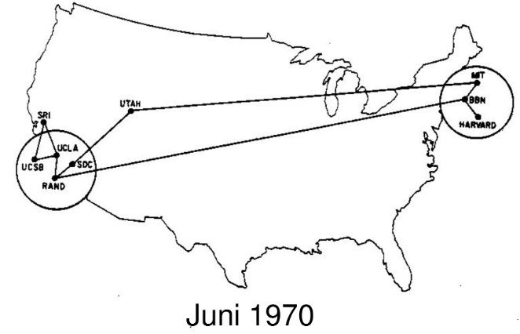

时间来到1970年，在你的建设下`ARPANET`飞速发展，在一年内从原来西部4个节点组成的简单网络逐渐发展为拥有9个节点，横跨东西海岸，初具规模的网络。

`ARPANET`的拓展极大地便利了东西海岸之间的通信，但用户仍然十分关心网络服务的性能。一条时延较小的转发路由将显著提升用户体验，尤其是在一些实时性要求很高的应用场景下。另外，路由策略对网络故障的容忍能力也是影响用户体验的重要因素，好的路由策略能够向用户隐藏一定程度的链路故障，使得个别链路断开后用户间的通信不至于中断。

`SDN`是一种集中式控制的网络架构，控制器可以方便地获取网络拓扑、各链路和交换机的性能指标、网络故障和拓扑变化等全局信息，这也是`SDN`的优势之一。在掌握全局信息的基础上，`SDN`就能实现更高效、更健壮的路由策略。

为帮助同学们理解，本指导书直接给出了一个示例。请运行示例程序，理解怎样利用`os_ken.topology.api`获取网络拓扑，并计算跳数最少的路由。

跳数最少的路由不一定是最快的路由，在实验任务三中，你将学习怎样利用`LLDP`和`Echo`数据包测量链路时延，并计算时延最小的路由。

为了帮助同学们理解，在热身部分中展示如何获取网络拓扑、计算基于跳数的最短路，这些内容有助于完成后续实验任务。

这一部分**不占实验分数，不强行要求，按需自学**即可。

#### 热身1: 拓扑感知

控制器首先要获取网络的拓扑结构，才能够对网络进行各种测量分析，网络拓扑主要包括主机、链路和交换机的相关信息。

- 代码示例

    调用`os_ken.topology.api`中的`get_all_host`、`get_all_link`、`get_all_switch`等函数，就可以获得全局拓扑的信息，可以参考[`controllers/task3/demo.py`](controllers/task3/demo.py)，了解如何进行链路感知。

- 链路发现原理
    
    `LLDP(Link Layer Discover Protocol)`即链路层发现协议，`OSKen`主要利用`LLDP`发现网络拓扑。`LLDP`被封装在以太网帧中，结构如下图。其中深灰色的即为`LLDP`负载，`Chassis ID TLV`,`Port ID TLV`和`Time to live TLV`是三个强制字段，分别代表交换机标识符（在局域网中是独一无二的），端口号和`TTL`。

    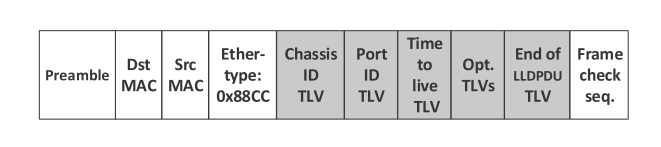

    接下来介绍`OSKen`如何利用`LLDP`发现链路，假设有两个`OpenFlow`交换机连接在控制器上，如下图：

    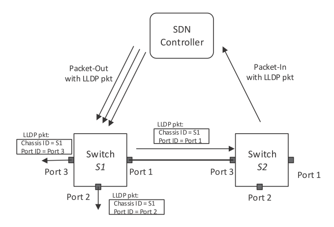

    1. `SDN`控制器构造`PacketOut`消息向`S1`的三个端口分别发送`LLDP`数据包，其中将`Chassis ID TLV`和`Port ID TLV`分别置为`S1`的`dpid`和端口号；

    2. 控制器向交换机`S1`中下发流表，流表规则为：将从`Controller`端口收到的`LLDP`数据包从他的对应端口发送出去；

    3. 控制器向交换机`S2`中下发流表，流表规则为：将从非`Controller`接收到的`LLDP`数据包发送给控制器；

    4. 控制器通过解析`LLDP`数据包，得到链路的源交换机，源接口，通过收到的`PacketIn`消息知道目的交换机和目的接口。

- 沉默主机现象

    主机如果没有主动发送过数据包，控制器就无法发现主机。运行前面的[`controllers/task3/demo.py`](controllers/task3/demo.py)时，你可能会看到`host`输出为空，这就是沉默主机现象导致的。你可以在`mininet`中运行`pingall`指令，令每个主机发出`ICMP`数据包，这样控制器就能够发现主机。当然命令的结果是`ping`不通，因为程序中并没有下发路由的代码。

#### 热身2: 计算最少跳数路径


下面第一个函数位于我们给出的[`controllers/network_awareness.py`](controllers/network_awareness.py)文件中，第二个函数位于[`controllers/task3/least_hops.py`](controllers/task3/least_hops.py)。核心逻辑是，当控制器接收到携带`ipv4`报文的`Packet_In`消息时，调用`networkx`计算最短路（也可以自行实现，比如Dijkstra算法），然后把相应的路由下发到沿途交换机，具体逻辑可见Python文件中。

<p style='color: red'><b>注意：least_hops.py未处理环路，请根据你在任务二中处理环路的代码对handle_arp函数稍加补充即可。</b></p>

```shell
uv run -m controllers.task3.least_hops
```

``` python
    # function in network_awareness.py
    def shortest_path(self, src, dst, weight='hop'):
        try:
            paths = list(nx.shortest_simple_paths(self.topo_map, src, dst, weight=weight))
            return paths[0]
        except:
            self.logger.info('host not find/no path')
    #
    # function in least_hops.py    
    def handle_ipv4(self, msg, src_ip, dst_ip, pkt_type):
        parser = msg.datapath.ofproto_parser

        dpid_path = self.network_awareness.shortest_path(src_ip, dst_ip,weight=self.weight)
        if not dpid_path:
            return
        self.path=dpid_path
        # get port path:  h1 -> in_port, s1, out_port -> h2
        port_path = []
        for i in range(1, len(dpid_path) - 1):
            in_port = self.network_awareness.link_info[(dpid_path[i], dpid_path[i - 1])]
            out_port = self.network_awareness.link_info[(dpid_path[i], dpid_path[i + 1])]
            port_path.append((in_port, dpid_path[i], out_port))
        self.show_path(src_ip, dst_ip, port_path)
        # send flow mod
        for node in port_path:
            in_port, dpid, out_port = node
            self.send_flow_mod(parser, dpid, pkt_type, src_ip, dst_ip, in_port, out_port)
            self.send_flow_mod(parser, dpid, pkt_type, dst_ip, src_ip, out_port, in_port)
```

因为沉默主机现象，前几次`ping`可能都会输出`host not find/no path`，这属于正常现象。

#### 任务：最小时延路径


跳数最少的路由不一定是最快的路由，链路时延也会对路由的快慢产生重要影响。请实时地（周期地）利用`LLDP`和`Echo`数据包测量各链路的时延，在网络拓扑的基础上构建一个有权图，然后基于此图计算最小时延路径。具体任务是，找出一条从`SDC` 到`MIT`时延最短的路径，输出经过的路线及总的时延，利用`Ping`包的`RTT`验证你的结果。请在`least_hops.py`的代码框架上，在新的文件下**新建**一个控制器（可以命名为`ShortestForward`或类似的名字），并完成任务。

##### 测量原理：链路时延

- 测量链路时延的思路可参考下图

  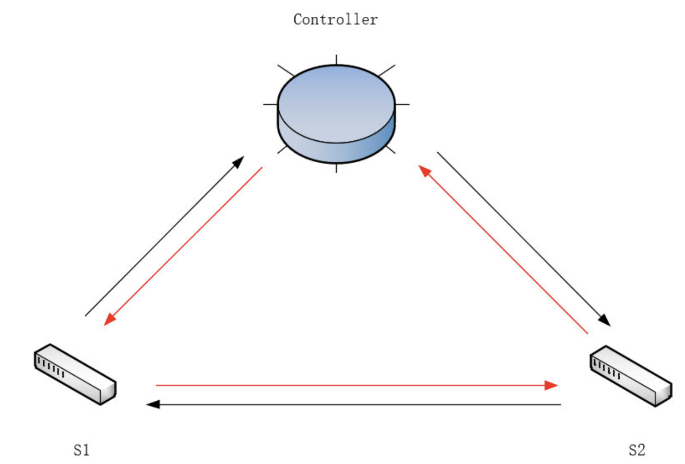

控制器将带有时间戳的`LLDP`报文下发给`S1`，`S1`转发给`S2`，`S2`上传回控制器（即内圈红色箭头的路径），根据收到的时间和发送时间即可计算出**控制器经`S1`到`S2`再返回控制器的时延**，记为`lldp_delay_s12`

反之，**控制器经`S2`到`S1`再返回控制器的时延**，记为`lldp_delay_s21`

交换机收到控制器发来的Echo报文后会立即回复控制器，我们可以利用`Echo Request/Reply`报文求出**控制器到`S1`、`S2`的往返时延**，记为`echo_delay_s1`, `echo_delay_s2`

则`S1`到`S2`的时延 `delay = (lldp_delay_s12 + lldp_delay_s21 - echo_delay_s1 - echo_delay_s2) / 2`

为此，我们需要对`OSKen`做如下修改：

1. [`.venv/lib/python3.14/site-packages/os_ken/topology/switches.py`](.venv/lib/python3.14/site-packages/os_ken/topology/switches.py)的`PortData/__init__()`

    `PortData`记录交换机的端口信息，我们需要增加`self.delay`属性记录上述的`lldp_delay`

    `self.timestamp`为`LLDP`包在发送时被打上的时间戳，具体发送的逻辑查看源码

    ```diff
    class PortData(object):
        def __init__(self, is_down, lldp_data):
            super(PortData, self).__init__()
            self.is_down = is_down
            self.lldp_data = lldp_data
            self.timestamp = None
            self.sent = 0
    +       self.delay = 0
    ```

2. [`.venv/lib/python3.14/site-packages/os_ken/topology/switches.py`](.venv/lib/python3.14/site-packages/os_ken/topology/switches.py)的`Switches/lldp_packet_in_handler()`

    `lldp_packet_in_handler()`处理接收到的`LLDP`包，在这里用收到`LLDP`报文的时间戳减去发送时的时间戳即为`lldp_delay`，由于`LLDP`报文被设计为经一跳后转给控制器，我们可将`lldp_delay`存入发送`LLDP`包对应的交换机端口

    ```diff
        @set_ev_cls(ofp_event.EventOFPPacketIn, MAIN_DISPATCHER)
        def lldp_packet_in_handler(self, ev):
    +       # add receive timestamp
    +       recv_timestamp = time.time()
            if not self.link_discovery:
                return

            msg = ev.msg
            try:
                src_dpid, src_port_no = LLDPPacket.lldp_parse(msg.data)
            except LLDPPacket.LLDPUnknownFormat:
                # This handler can receive all the packets which can be
                # not-LLDP packet. Ignore it silently
                return
            
    +       # calc the delay of lldp packet
    +       for port, port_data in self.ports.items():
    +           if src_dpid == port.dpid and src_port_no == port.port_no:
    +               send_timestamp = port_data.timestamp
    +               if send_timestamp:
    +                   port_data.delay = recv_timestamp - send_timestamp
            
            ...
    ```

3. 获取`lldp_delay`

    在你们需要完成的计算时延的`APP`中，利用`lookup_service_brick`获取到正在运行的`switches`的实例（即步骤1、2中被我们修改的类），按如下的方式即可获取相应的`lldp_delay`

    ```python
        from os_ken.base.app_manager import lookup_service_brick
        
        ...
        
        @set_ev_cls(ofp_event.EventOFPPacketIn, MAIN_DISPATCHER)
        def packet_in_hander(self, ev):
            msg = ev.msg
            dpid = msg.datapath.id
            try:
                src_dpid, src_port_no = LLDPPacket.lldp_parse(msg.data)

                if self.switches is None:
                    self.switches = lookup_service_brick('switches')

                for port in self.switches.ports.keys():
                    if src_dpid == port.dpid and src_port_no == port.port_no:
                        lldp_delay[(src_dpid, dpid)] = self.switches.ports[port].delay
            except:
                return
    ```

##### 运行拓扑

```shell
sudo uv run topos/topo_1970.py
```

##### 问题提示

- 注意时延不应为负，测量出负数应取0。

##### 结果示例

- 输出格式参考下图。
- 每条链路的时延已经在拓扑文件中预设了，请将自己的测量结果与预设值对比验证。

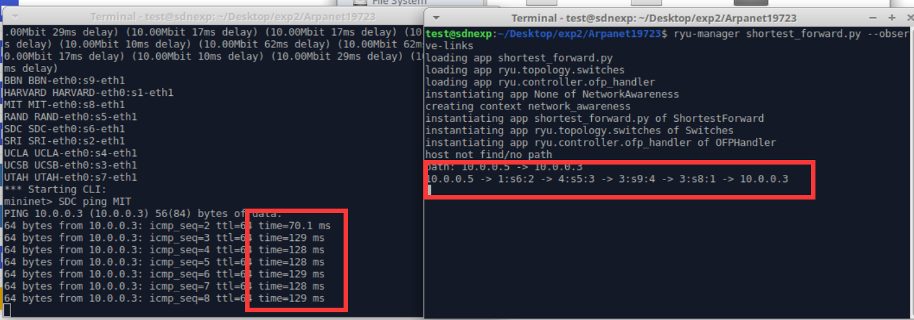

### 4. (选做) 实验任务四：容忍链路故障

1970年的网络硬件发展尚不成熟，通信链路和交换机端口发生故障的概率较高。请设计`OSKen app`，在任务三的基础上实现容忍链路故障的路由选择：每当链路出现故障时，重新选择当前可用路径中时延最低的路径；当链路故障恢复后，也重新选择新的时延最低的路径。

请在实验报告里附上你计算的（1）最小时延路径（2）最小时延路径的`RTT`（3）链路故障/恢复后发生的路由转移。

#### 任务说明

- 模拟链路故障

`mininet`中可以用`link down`和`link up`来模拟**链路故障**和**故障恢复**:

```shell
mininet> link s1 s4 down
mininet> link s1 s4 up
```

- 控制器捕捉链路故障

链路状态改变时，链路关联的端口状态也会变化，从而产生端口状态改变的事件，即`EventOFPPortStatus`，通过将此事件与你设计的处理函数绑定在一起，就可以获取状态改变的信息，执行相应的处理。

`os_ken`自带的`EventOFPPortStatus`事件处理函数位于[`.venv/lib/python3.14/site-packages/os_ken/controller/ofp_handler.py`](.venv/lib/python3.14/site-packages/os_ken/controller/ofp_handler.py)中，部分代码截取在下方。你可以以此为例，在你的代码中实现你需要的`EventOFPPortStatus`事件处理函数。

```python
@set_ev_handler(ofp_event.EventOFPPortStatus, MAIN_DISPATCHER)
def port_status_handler(self, ev):
    msg = ev.msg
    datapath = msg.datapath
    ofproto = datapath.ofproto

    if msg.reason in [ofproto.OFPPR_ADD, ofproto.OFPPR_MODIFY]:
        datapath.ports[msg.desc.port_no] = msg.desc
    elif msg.reason == ofproto.OFPPR_DELETE:
        datapath.ports.pop(msg.desc.port_no, None)
    else:
        return

    self.send_event_to_observers(
        ofp_event.EventOFPPortStateChange(
            datapath, msg.reason, msg.desc.port_no),
        datapath.state)
```

- `OFPFC_DELETE` 消息

与向交换机中增加流表的`OFPFC_ADD`命令不同，`OFPFC_DELETE` 消息用于删除交换机中符合匹配项的所有流表。

由于添加和删除都属于`OFPFlowMod`消息，因此只需稍微修改`add_flow()`函数，即可生成`delete_flow()`函数。

- `Packet_In`消息的合理利用

基本思路是在链路发生改变时，删除受影响的链路上所有交换机上的相关流表的信息，下一次交换机将匹配默认流表项，向控制器发送`packet_in`消息，控制器重新计算并下发最小时延路径。

#### 结果示例

`SDC ping MIT`，一开始选择时延最小路径，`RTT`约`128ms`。

`s9`和`s8`之间的链路故障后，重新选择现存的时延最小路径，`RTT`约`146ms`。

`s9`和`s8`之间的链路从故障中恢复后，重新选择时延最小路径。

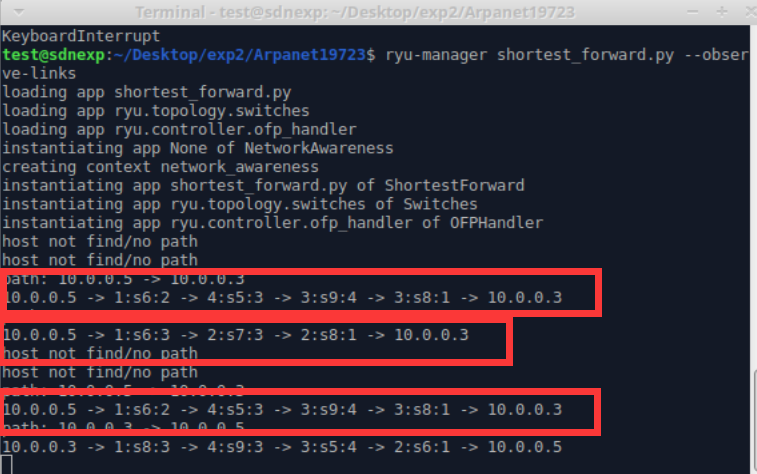

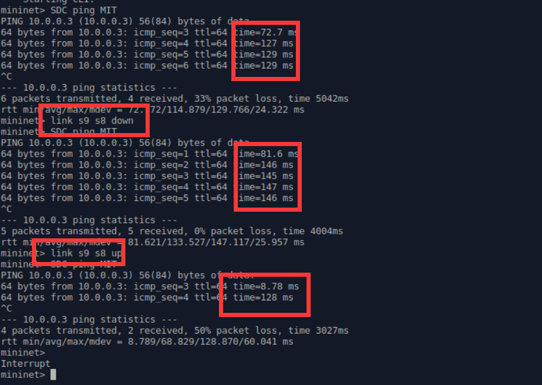


### 5. 拓展资料

- SDN论坛：[sdnlab](https://www.sdnlab.com/)
- 关于Mininet的更多资料：[Mininet Doc](https://github.com/mininet/mininet/wiki/Documentation)，[Mininet API](http://mininet.org/api/annotated.html)
- 关于OS-Ken App开发的更多资料：[OS-Ken Documentation](https://docs.openstack.org/os-ken/latest/) [Ryu Book](https://osrg.github.io/ryu-book/en/html/index.html)